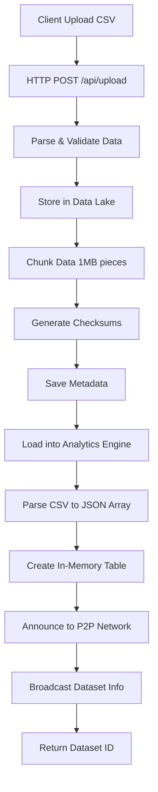
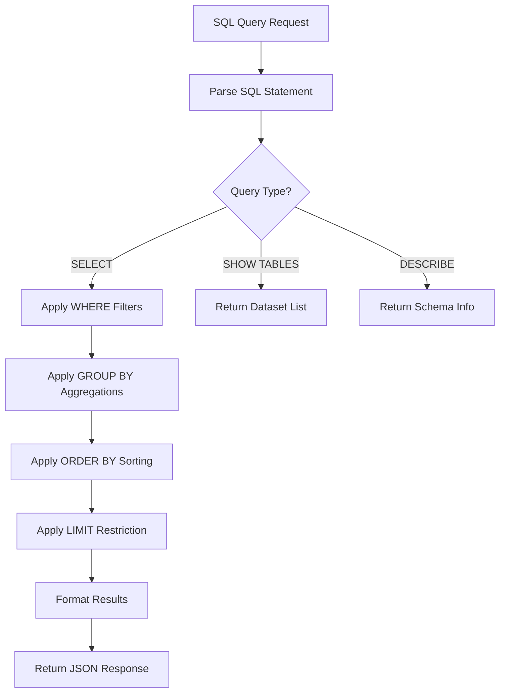
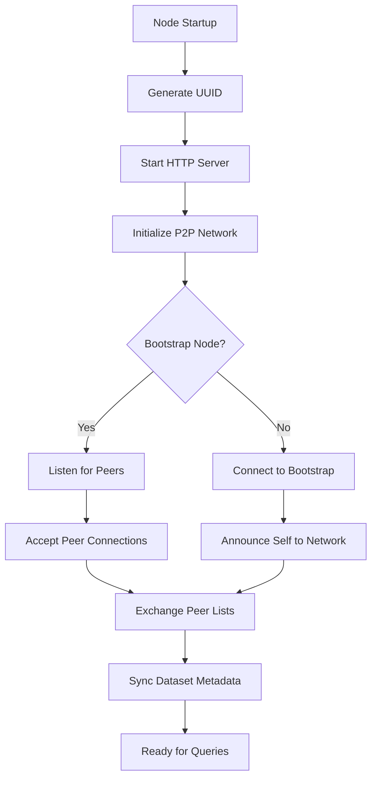

# P2P Data Lake Analytics - Architecture & Workflow

## 🏗️ System Architecture

```
┌─────────────────────────────────────────────────────────────────────────────┐
│                           P2P Data Lake Network                              │
├─────────────────────────────────────────────────────────────────────────────┤
│                                                                             │
│  ┌─────────────────┐    ┌─────────────────┐    ┌─────────────────┐          │
│  │   Node 1:3000   │    │   Node 2:3001   │    │   Node 3:3002   │          │
│  │  (Bootstrap)    │    │    (Peer)       │    │    (Peer)       │          │
│  ├─────────────────┤    ├─────────────────┤    ├─────────────────┤          │
│  │ Web Dashboard   │    │ API Only        │    │ API Only        │          │
│  │ Socket.IO Hub   │    │ Data Analytics  │    │ Data Analytics  │          │
│  ├─────────────────┤    ├─────────────────┤    ├─────────────────┤          │
│  │ Analytics Eng.  │    │ Analytics Eng.  │    │ Analytics Eng.  │          │
│  │ - SQL Parser    │    │ - SQL Parser    │    │ - SQL Parser    │          │
│  │ - Query Engine  │    │ - Query Engine  │    │ - Query Engine  │          │
│  │ - Aggregations  │    │ - Aggregations  │    │ - Aggregations  │          │
│  ├─────────────────┤    ├─────────────────┤    ├─────────────────┤          │
│  │ Data Lake       │    │ Data Lake       │    │ Data Lake       │          │
│  │ - Chunked Data  │    │ - Chunked Data  │    │ - Chunked Data  │          │
│  │ - Metadata      │    │ - Metadata      │    │ - Metadata      │          │
│  │ - File Storage  │    │ - File Storage  │    │ - File Storage  │          │
│  ├─────────────────┤    ├─────────────────┤    ├─────────────────┤          │
│  │ P2P Network     │    │ P2P Network     │    │ P2P Network     │          │
│  │ - Node Discovery│◄──►│ - Node Discovery│◄──►│ - Node Discovery│          │
│  │ - Data Sync     │    │ - Data Sync     │    │ - Data Sync     │          │
│  └─────────────────┘    └─────────────────┘    └─────────────────┘          │
│           │                       │                       │                 │
│           ▼                       ▼                       ▼                 │
│  ┌─────────────────────────────────────────────────────────────────────────┐ │
│  │                        Shared Data Layer                                │ │
│  │  ./data/        ./metadata/        ./temp/        ./logs/               │ │
│  │  - chunks       - dataset.meta     - queries      - system.log         │ │
│  │  - datasets     - chunk.meta       - results      - p2p.log            │ │
│  └─────────────────────────────────────────────────────────────────────────┘ │
└─────────────────────────────────────────────────────────────────────────────┘
```

## 📋 Component Breakdown

### 1. **Application Layer** (`src/app.js`)
```javascript
P2PDataLakeApp
├── Express HTTP Server (REST API)
├── Socket.IO Server (Real-time WebSocket)
├── Web Dashboard (React-like frontend)
└── Request Routing & Middleware
```

### 2. **Analytics Engine** (`src/analytics/simple-analytics-engine.js`)
```javascript
SimpleAnalyticsEngine
├── SQL Parser (SELECT, WHERE, GROUP BY, ORDER BY, LIMIT)
├── In-Memory Query Engine
├── Aggregation Functions (COUNT, AVG, SUM, MAX, MIN)
├── Data Type Inference
└── Query Optimization & Caching
```

### 3. **Data Lake Storage** (`src/storage/data-lake.js`)
```javascript
DataLake
├── File-based Storage System
├── Data Chunking (1MB chunks default)
├── Metadata Management
├── Checksum Verification
├── Dataset Indexing
└── Storage Statistics
```

### 4. **P2P Networking** (`src/network/`)
```javascript
P2PNetwork + NetworkManager
├── WebSocket Connections (peer-to-peer)
├── Node Discovery Protocol
├── Message Broadcasting
├── Peer Management
├── Network Topology Mapping
└── Data Announcement System
```

## 🔄 Data Flow Workflow

### **1. Data Upload Workflow**


### **2. Query Execution Workflow**


### **3. P2P Network Workflow**


## 📂 File System Architecture

```
P2P/
├── src/
│   ├── app.js                    # Main application entry
│   ├── peer.js                   # Peer node launcher
│   ├── network/
│   │   ├── network-manager.js    # WebSocket management
│   │   └── p2p-network-simple.js # P2P protocol implementation
│   ├── storage/
│   │   └── data-lake.js          # Distributed storage engine
│   └── analytics/
│       └── simple-analytics-engine.js # SQL query processor
├── public/
│   └── index.html                # Web dashboard UI
├── scripts/
│   ├── start-network.js          # Multi-node launcher
│   ├── upload-sample-data.js     # Test data loader
│   └── check-network.js          # Network status checker
├── sample-data/
│   ├── employees.csv             # Test dataset 1
│   └── products.csv              # Test dataset 2
├── data/                         # Runtime data storage
│   ├── *.chunk                   # Data chunks
│   └── datasets/                 # Dataset files
├── metadata/                     # Runtime metadata
│   ├── *.meta.json              # Dataset metadata
│   └── *.chunk.meta.json        # Chunk metadata
├── temp/                         # Temporary query files
├── logs/                         # System logs
├── config.json                   # System configuration
├── package.json                  # Dependencies
└── README.md                     # Documentation
```

## ⚡ Key Technical Decisions

### **1. Storage Strategy**
- **File-based chunks** instead of database for portability
- **1MB chunk size** for optimal memory usage
- **SHA-256 checksums** for data integrity
- **JSON metadata** for fast indexing

### **2. Analytics Approach**
- **In-memory processing** for speed
- **Custom SQL parser** for flexibility
- **JavaScript-native operations** for simplicity
- **No external database dependencies**

### **3. Networking Design**
- **WebSocket-based P2P** for real-time communication
- **Bootstrap node pattern** for discovery
- **Event-driven architecture** for scalability
- **Graceful degradation** when peers disconnect

### **4. API Design**
- **RESTful endpoints** for standard operations
- **Socket.IO** for real-time updates
- **JSON-only responses** for consistency
- **CORS-enabled** for web integration

## 🔧 Configuration Flow

```javascript
config.json
├── network: { port, peers, discovery }
├── storage: { paths, replication, chunks }
├── analytics: { engine, cache, timeouts }
├── security: { encryption, keys, origins }
└── logging: { level, paths, rotation }
```

## 🎯 Current Implementation Status

| Component | Status | Functionality |
|-----------|--------|---------------|
| **Data Storage** | ✅ Complete | Chunked, checksummed, metadata |
| **Analytics Engine** | ✅ Complete | SQL queries, aggregations |
| **Web Dashboard** | ✅ Complete | Upload, query, monitor |
| **REST API** | ✅ Complete | Full CRUD operations |
| **Single Node** | ✅ Complete | Standalone operation |
| **P2P Discovery** | ⚠️ Partial | Basic WebSocket setup |
| **Data Replication** | ❌ Missing | Cross-node sync needed |
| **Distributed Queries** | ❌ Missing | Multi-node coordination |

This architecture provides a solid foundation for distributed data analytics with the flexibility to enhance P2P capabilities as needed!
